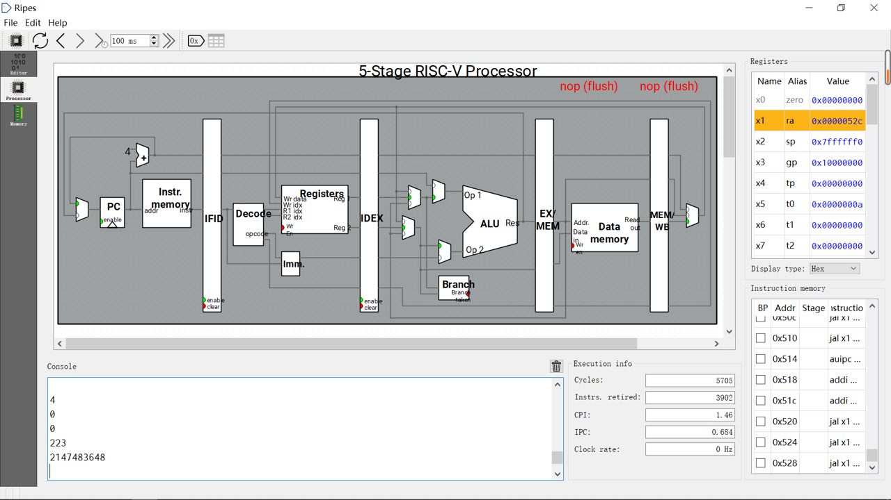
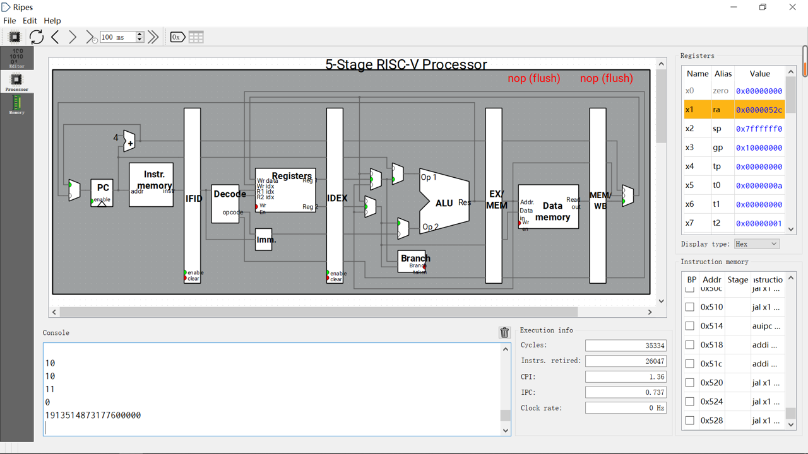

# Project 1 Report

- Course: VE370
- Author: Zhimin Sun
- Language: RISC-V

### Demo

#### Case 1

##### Array

$[\; 256, -256, 256, -256, 256, -256, 256, 128\;]$

##### Result


#### Case 2

##### Array

$[\; 256, 256, 256, 128\;]$

##### Result



#### Case 3

##### Array

$[\;-5,1,-3,-6,-11,100,-122,12,7,18,5,-1,1,20,3,-9,-21,-24,-11,7\;]$

##### Result



### Appendix

#### Codes

```assembly
################################
#                              #
#        VE370 Project1        #
#      Author: Zhimin Sun      #
#       Language: RISC-V       #
#                              #
################################
.data
array:
    .word -5,1,-3,-6,-11,100,-122,12,7,18,5,-1,1,20,3,-9,-21,-24,-11,7
# Here is the array I use in this example

.text
Start:
    j main

################################
#                              #
#   Helper function for bool   #
#                              #
################################
ReturnFalse:
    addi x10, x0, 0
    jr x1

ReturnTrue:
    addi x10, x0, 1
    jr x1

################################
#                              #
#      Operation function      #
#                              #
################################
# Multiply
Multiply:
    addi x8, x0, 0
MulStart:
    beq x10, x0, MulFinish      # if x10 == 0 then MulFinish
    beq x11, x0, MulFinish      # if x11 == 0 then MulFinish
    andi x5, x10, 1
    beq x5, x0, MulNext         # if x5 == 0 then MulNext
    add x8, x8, x11             # x8 = x8 + x11
MulNext:
    srli x10, x10, 1
    slli x11, x11, 1
    j MulStart
MulFinish:
    addi x10, x8, 0
    jr x1

# Long long Multiply
LongMultiply:                   # x10 * [x11 x12]
    addi sp, sp, -4             # sp = sp - 4
    sw x1, 0(sp)                # Save return address
    addi x22, x10, 0            # Save x10
    jal x1, Multiply
    addi x20, x10, 0            # High
    bge x22, x0, LowMulPre      # if x10 >= 0 then LowMulPre
    addi x10, x0, 0xffffffff
    addi x11, x12, 0
    jal x1, Multiply
    add x20, x10, x20           # High
LowMulPre:
    addi x21, x0, 0             # Low
    addi x18, x0, 0
    addi x19, x0, 32
LowMulStart:
    beq x22, x0, LowMulFinish   # if x22 == 0 then LowMulFinish
    andi x5, x22, 1
    beq x5, x0, LowMulNext      # if x5 == 0 then LowMulNext
    addi x5, x0, 32
    beq x19, x5, NoOffset       # Ignore for first time
    srl x5, x12, x19
    add x20, x20, x5
NoOffset:
    sll x5, x12, x18
    add x21, x21, x5
    bgeu x21, x5, LowMulNext
    addi x20, x20, 1
LowMulNext:
    srli x22, x22, 1
    addi x18, x18, 1
    addi x19, x19, -1
    j LowMulStart
LowMulFinish:
    lw x1, 0(sp)                # load return address
    addi sp, sp, 4              # sp = sp + 4
    addi x10, x20, 0
    addi x11, x21, 0
    jr x1

# Divide
Divide:
    addi x7, x0, 0              # pos or neg
    addi x8, x0, 0              # quotient
    bgt x10, x0, DividePos      # if dividend > 0 then DividePos
    sub x10, x0, x10            # remainder
    addi x7, x7, 1
DividePos:
    bgt x11, x0, DividePreInit  # if divisor > 0 then DividePreInit
    sub x11, x0, x11
    addi x7, x7, 1
DividePreInit:
    addi x9, x11, 0             # divisor
DividePre:
    addi x5, x0, 1
    slli x5, x5, 30
    and x6, x9, x5
    bne x6, x0, DivideStart     # if nearly negative then DivideStart
    bge x9, x10, DivideStart    # if divisor >= dividend then DivideStart
    slli x9, x9, 1
    j DividePre
DivideStart:
    blt x9, x11, DivideFinish   # if dividend too small then DivideFinish
    slli x8, x8, 1              # x8 = x8 << 1
    blt x10, x9, DivideNext     # if x10 < x9 then DivideNext
    sub x10, x10, x9            # x10 = x10 - x9
    addi x8, x8, 1              # x8 = x8 + 1
DivideNext:
    srli x9, x9, 1
    j DivideStart
DivideFinish:
    addi x5, x0, 1
    bne x7, x5, DivideOut       # if x7 != 1 then DivideOut
    sub x8, x0, x8
DivideOut:
    addi x11, x10, 0
    addi x10, x8, 0
    jr x1

# Unsigned Divide
UDivide:                        # Use x8, x9
    addi x8, x0, 0              # quotient
    addi x9, x11, 0             # divisor
UDividePre:
    addi x5, x0, 1
    slli x5, x5, 31
    and x6, x9, x5
    bne x6, x0, UDivideStart    # if 32-bit then UDivideStart
    bgeu x9, x10, UDivideStart  # if divisor >= dividend then UDivideStart
    slli x9, x9, 1
    j UDividePre
UDivideStart:
    bltu x9, x11, UDivideFinish # if dividend too small then UDivideFinish
    slli x8, x8, 1              # x8 = x8 << 1
    bltu x10, x9, UDivideNext   # if x10 < x9 then UDivideNext
    sub x10, x10, x9            # x10 = x10 - x9
    addi x8, x8, 1              # x8 = x8 + 1
UDivideNext:
    srli x9, x9, 1
    j UDivideStart
UDivideFinish:
    addi x11, x10, 0
    addi x10, x8, 0
    jr x1

# Long Long Divide
LongDivide:                     # positive [x10 x11] / x12
    addi x20, x0, 0             # quo high
    addi x21, x0, 0             # quo low
    addi x22, x0, 0             # remainder
    addi x23, x10, 0            # dividend high 32bits (x10)
    addi sp, sp, -4             # sp = sp - 4
    sw x1, 0(sp)                # Save return address
    addi x10, x11, 0
    addi x11, x12, 0
    jal x1, UDivide
    add x21, x21, x10           # x11 / x12
    add x22, x22, x11           # x11 % x12
    addi x10, x23, 0
    addi x11, x12, 0
    jal x1, UDivide
    add x20, x20, x10           # x10 / x12
    slli x10, x11, 16
    addi x11, x12, 0
    jal x1, UDivide
    slli x5, x10, 16
    slli x6, x11, 16
    add x21, x21, x5
    add x22, x22, x6
    bgeu x21, x5, LongDividLCout
    addi x20, x20, 1
LongDividLCout:
    addi x10, x22, 0
    addi x11, x12, 0
    jal x1, UDivide
    add x21, x21, x10           # remainder / x12
    addi x22, x11, 0            # real remainder = remainder % x12
    bgeu x21, x10, LongDividRCout
    addi x20, x20, 1
LongDividRCout:
    lw x1, 0(sp)                # load return address
    addi sp, sp, 4              # sp = sp + 4
    addi x10, x20, 0            # quo high
    addi x11, x21, 0            # quo low
    addi x12, x22, 0            # remainder
    jr x1

################################
#                              #
#       Convert function       #
#                              #
################################
IntBinToDec:
    addi sp, sp, -4
    sw x1, 0(sp)
    blt x10, x0, NegIntBinToDec
PosIntBinToDec:
    addi x11, x0, 10
    jal x1, UDivide             # x10 = x10 / 10
    addi x5, x11, 0x30          # x11 = x11 % 10
    addi sp, sp, -4
    sw x5, 0(sp)
    beq x10, x0, PrintDec
    jal x1, IntBinToDec
PrintDec:
    addi x10, sp, 0
    jal x1, SystemWrite
    lw x1, 4(sp)
    addi sp, sp, 8
    jr x1
NegIntBinToDec:
    sub x18, x0, x10
    addi sp, sp, -4
    addi x5, x0, 0x2d           # x5 = '-'
    sw x5, 0(sp)
    addi x10, sp, 0
    jal x1, SystemWrite
    addi sp, sp, 4
    addi x10, x18, 0
    j PosIntBinToDec

LongBinToDec:                   # [x10 x11] long long
    addi sp, sp, -4
    sw x1, 0(sp)
    bge x10, x0, PosLongBinToDec
    blt x10, x0, NegLongBinToDec
LongIntBinToDec:
    addi x10, x11, 0
    jal x1, IntBinToDec
    lw x1, 0(sp)
    addi sp, sp, 4
    jr x1
PosLongBinToDec:
    blt x11, x0, PosLongBinCout
    beq x10, x0, LongIntBinToDec
PosLongBinCout:
    addi x12, x0, 10
    jal x1, LongDivide          # [x10 x11] = [x10 x11] / 10
    addi x5, x12, 0x30          # x12 = [x10 x11] % 10
    addi sp, sp, -4
    sw x5, 0(sp)
    jal x1, LongBinToDec
    addi x10, sp, 0
    jal x1, SystemWrite
    lw x1, 4(sp)
    addi sp, sp, 8
    jr x1
NegLongBinToDec:
    addi x5, x0, 1
    xori x8, x10, -1
    xori x9, x11, -1
    addi x9, x9, 1
    bgeu x9, x5, NegLongBinCout
    addi x8, x8, 1
NegLongBinCout:
    addi sp, sp, -4
    addi x5, x0, 0x2d           # x5 = '-'
    sw x5, 0(sp)
    addi x10, sp, 0
    jal x1, SystemWrite
    addi sp, sp, 4
    addi x10, x8, 0
    addi x11, x9, 0
    j PosLongBinCout

################################
#                              #
#        Basic function        #
#                              #
################################
IsPos:
    bgt x10, x0, ReturnTrue     # if x10 > x0 then true
    j ReturnFalse               # else false

IsNeg:
    blt x10, x0, ReturnTrue     # if x10 < x0 then true
    j ReturnFalse               # else false

IsSmall:
    addi x5, x0, 10
    addi x6, x0, -10
    bgt x10, x5, ReturnFalse    # if x10 > 10 then false
    blt x10, x6, ReturnFalse    # if x10 < -10 then false
    j ReturnTrue                # else true

CntChoose:                      # x10 is value, x11 is cnttype
    addi x5, x0, 1
    addi x6, x0, -1
    beq x11, x5, IsPos          # if x11 == 1 then call IsPos
    beq x11, x6, IsNeg          # if x11 == -1 then call IsNeg
    j IsSmall                   # default call IsSmall

CountArray:
    addi sp, sp, -4             # sp = sp - 4
    sw x1, 0(sp)                # save return address
    addi x8, x11, -1            # C: int i = arraySize - 1
    addi x9, x0, 0              # C: int cnt = 0
    addi x18, x10, 0            # Save address of A
CountArrayLoop:
    blt x8, x0, CountArrayDone  # if i < 0 then break
    addi x11, x12, 0
    slli x5, x8, 2
    add x5, x5, x18             # x5 is the address of A[i]
    lw x10, 0(x5)               # x10 = A[i]
    jal x1, CntChoose           # Call CntChoose
    add x9, x9, x10             # cnt += result
    addi x8, x8, -1             # i--
    j CountArrayLoop
CountArrayDone:
    lw x1, 0(sp)                # load return address
    addi sp, sp, 4              # sp = sp + 4
    addi x10, x9, 0
    jr x1

CalAvg:
    addi x18, x10, 0            # Save address of A
    addi x19, x11, 0            # Save value of arraySize
CalAvgStart:
    addi sp, sp, -4             # sp = sp - 4
    sw x1, 0(sp)                # save return address
    addi x5, x11, -1
    bne x5, x12, CalAvgRec      # if arraySize - 1 == position then break
    slli x5, x12, 2
    add x5, x10, x5             # address of A[arraySize - 1]
    lw x10, 0(x5)               # x10 = A[arraySize - 1]
    lw x1, 0(sp)                # load return address
    addi sp, sp, 4              # sp = sp + 4
    jr x1
CalAvgRec:
    addi sp, sp, -4             # sp = sp - 4
    sw x12, 0(sp)               # Save position
    addi x12, x12, 1            # position = position + 1
    jal x1, CalAvgStart         # Call CalAvg
    lw x12, 0(sp)               # Load position
    addi sp, sp, 4              # sp = sp + 4
    addi x5, x12, 1             # x5 = x12 + 1
    sub x5, x19, x5             # x5 = x19 - x5
    addi x11, x5, 0             # x11 = x5
    jal x1, Multiply            # Call Multiply
    slli x5, x12, 2
    add x5, x5, x18             # address of A[position]
    lw x6, 0(x5)                # x6 = A[position]
    add x10, x6, x10            # x10 = x6 + x10
    sub x11, x19, x12           # x11 = x19 - x12
    jal x1, Divide              # Call Divide
    lw x1, 0(sp)                # load return address
    addi sp, sp, 4              # sp = sp + 4
    jr x1

CalProd:
    addi sp, sp, -4             # sp = sp - 4
    sw x1, 0(sp)                # Save return address
    addi x23, x0, 0             # i = 0
    addi x24, x0, 0             # product(high) = 0
    addi x25, x0, 1             # product(low) = 1
    addi x26, x10, 0            # Save address of A
    addi x27, x11, 0            # Save arraySize
CalProdRec:
    bge x23, x27, CalProdDone   # if i >= arraySize then CalProdDone
    slli x5, x23, 2
    add x5, x5, x26             # address of A[i]
    lw x10, 0(x5)               # x10 = A[position]
    addi x11, x24, 0
    addi x12, x25, 0
    jal x1, LongMultiply        # Call LongMultiply
    addi x24, x10, 0
    addi x25, x11, 0
    addi x23, x23, 1            # i++
    j CalProdRec
CalProdDone:
    lw x1, 0(sp)                # load return address
    addi sp, sp, 4              # sp = sp + 4
    addi x10, x24, 0
    addi x11, x25, 0
    jr x1

SystemWrite:
    addi x11, x10, 0            # address of output
    addi x10, x0, 1             # stdout
    addi x12, x0, 1             # length
    addi x17, x0, 64            # __NR_write 64
    ecall
    jr x1

SystemWriteEndl:
    addi sp, sp, -4
    addi x5, x0, 0x0a           # x5 = '\n'
    sw x5, 0(sp)
    addi x10, x0, 1             # stdout
    addi x11, sp, 0             # address of '\n'
    addi x12, x0, 1             # length
    addi x17, x0, 64            # __NR_write 64
    ecall
    addi sp, sp, 4
    jr x1

main:
    la x10, array
    addi x11, x0, 20
    addi x12, x0, 1
    jal x1, CountArray          # Call CountArray
    jal x1, IntBinToDec
    jal x1, SystemWriteEndl
    
    la x10, array
    addi x11, x0, 20
    addi x12, x0, -1
    jal x1, CountArray          # Call CountArray
    jal x1, IntBinToDec
    jal x1, SystemWriteEndl

    la x10, array
    addi x11, x0, 20
    addi x12, x0, 0
    jal x1, CountArray          # Call CountArray
    jal x1, IntBinToDec
    jal x1, SystemWriteEndl

    la x10, array
    addi x11, x0, 20
    addi x12, x0, 0
    jal x1, CalAvg              # Call CalAvg
    jal x1, IntBinToDec
    jal x1, SystemWriteEndl

    la x10, array
    addi x11, x0, 20
    jal x1, CalProd             # Call CalProd
    jal x1, LongBinToDec
    jal x1, SystemWriteEndl

```

